# [📈 Live Status](https://LeeYoungJin.github.io/fg_upptime): <!--live status--> **🟩 All systems operational**

This repository contains the open-source uptime monitor and status page for [LeeYoungJin](https://LeeYoungJin.github.io/fg_upptime), powered by [Upptime](https://github.com/upptime/upptime).

With [Upptime](https://upptime.js.org), you can get your own unlimited and free uptime monitor and status page, powered entirely by a GitHub repository. We use [Issues](https://github.com/LeeYoungJin/fg_upptime/issues) as incident reports, [Actions](https://github.com/LeeYoungJin/fg_upptime/actions) as uptime monitors, and [Pages](https://LeeYoungJin.github.io/fg_upptime) for the status page.

<!--start: status pages-->
<!-- This summary is generated by Upptime (https://github.com/upptime/upptime) -->
<!-- Do not edit this manually, your changes will be overwritten -->
<!-- prettier-ignore -->
| URL | Status | History | Response Time | Uptime |
| --- | ------ | ------- | ------------- | ------ |
|  [CompanyWise1](https://comp1.wisereport.co.kr/servercheck.aspx) | 🟩 Up | [company-wise1.yml](https://github.com/LeeYoungJin/fg_upptime/commits/HEAD/history/company-wise1.yml) | 

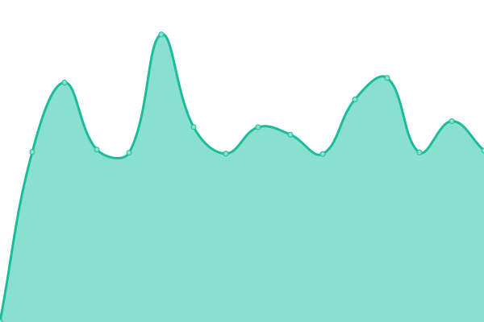 986ms
     
 | 

<a href="https://LeeYoungJin.github.io/fg_upptime/history/company-wise1">96.82%</a>
    

|  [CompanyWise2](https://comp2.wisereport.co.kr/servercheck.aspx) | 🟩 Up | [company-wise2.yml](https://github.com/LeeYoungJin/fg_upptime/commits/HEAD/history/company-wise2.yml) | 

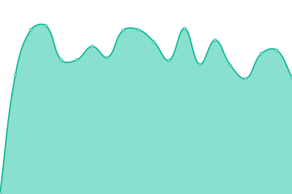 1197ms
     
 | 

<a href="https://LeeYoungJin.github.io/fg_upptime/history/company-wise2">96.88%</a>
    

|  [CompanyWise3](https://comp3.wisereport.co.kr/servercheck.aspx) | 🟩 Up | [company-wise3.yml](https://github.com/LeeYoungJin/fg_upptime/commits/HEAD/history/company-wise3.yml) | 

 1196ms
     
 | 

<a href="https://LeeYoungJin.github.io/fg_upptime/history/company-wise3">96.69%</a>
    

|  [CompanyGuide1](https://comp2.fnguide.com/server_variables.asp) | 🟩 Up | [company-guide1.yml](https://github.com/LeeYoungJin/fg_upptime/commits/HEAD/history/company-guide1.yml) | 

 1285ms
     
 | 

<a href="https://LeeYoungJin.github.io/fg_upptime/history/company-guide1">97.00%</a>
    

|  [CompanyGuide2](https://comp3.fnguide.com/server_variables.asp) | 🟩 Up | [company-guide2.yml](https://github.com/LeeYoungJin/fg_upptime/commits/HEAD/history/company-guide2.yml) | 

 1058ms
     
 | 

<a href="https://LeeYoungJin.github.io/fg_upptime/history/company-guide2">97.06%</a>
    

|  [CompanyGuide3](https://comp4.fnguide.com/server_variables.asp) | 🟩 Up | [company-guide3.yml](https://github.com/LeeYoungJin/fg_upptime/commits/HEAD/history/company-guide3.yml) | 

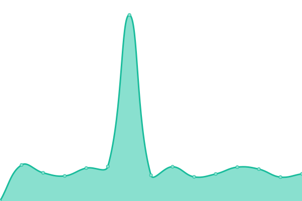 1013ms
     
 | 

<a href="https://LeeYoungJin.github.io/fg_upptime/history/company-guide3">97.12%</a>
    

|  [CompanyGuide4](https://comp5.fnguide.com/server_variables.asp) | 🟩 Up | [company-guide4.yml](https://github.com/LeeYoungJin/fg_upptime/commits/HEAD/history/company-guide4.yml) | 

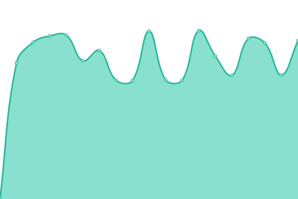 849ms
     
 | 

<a href="https://LeeYoungJin.github.io/fg_upptime/history/company-guide4">97.19%</a>
    

|  [FnGuide.com1](https://www1.fnguide.com/Etc/Service?id=Monitoring_adm) | 🟩 Up | [fn-guide-com1.yml](https://github.com/LeeYoungJin/fg_upptime/commits/HEAD/history/fn-guide-com1.yml) | 

 1090ms
     
 | 

<a href="https://LeeYoungJin.github.io/fg_upptime/history/fn-guide-com1">97.25%</a>
    

|  [FnGuide.com2](https://www2.fnguide.com/Etc/Service?id=Monitoring_adm) | 🟩 Up | [fn-guide-com2.yml](https://github.com/LeeYoungJin/fg_upptime/commits/HEAD/history/fn-guide-com2.yml) | 

 1074ms
     
 | 

<a href="https://LeeYoungJin.github.io/fg_upptime/history/fn-guide-com2">97.31%</a>
    

|  [WiseReport1](https://www1.wisereport.co.kr/servercheck.aspx) | 🟩 Up | [wise-report1.yml](https://github.com/LeeYoungJin/fg_upptime/commits/HEAD/history/wise-report1.yml) | 

 1133ms
     
 | 

<a href="https://LeeYoungJin.github.io/fg_upptime/history/wise-report1">97.37%</a>
    

|  [WiseReport2](https://www2.wisereport.co.kr/servercheck.aspx) | 🟩 Up | [wise-report2.yml](https://github.com/LeeYoungJin/fg_upptime/commits/HEAD/history/wise-report2.yml) | 

 938ms
     
 | 

<a href="https://LeeYoungJin.github.io/fg_upptime/history/wise-report2">97.58%</a>
    

|  [WiseReport3](https://www3.wisereport.co.kr/servercheck.aspx) | 🟩 Up | [wise-report3.yml](https://github.com/LeeYoungJin/fg_upptime/commits/HEAD/history/wise-report3.yml) | 

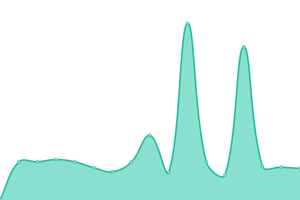 970ms
     
 | 

<a href="https://LeeYoungJin.github.io/fg_upptime/history/wise-report3">97.78%</a>
    

|  [Retamin1](https://app1.wisereport.co.kr/Home/ServerCheck) | 🟩 Up | [retamin1.yml](https://github.com/LeeYoungJin/fg_upptime/commits/HEAD/history/retamin1.yml) | 

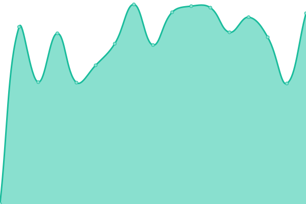 915ms
     
 | 

<a href="https://LeeYoungJin.github.io/fg_upptime/history/retamin1">97.83%</a>
    

|  [Retamin2](https://app2.wisereport.co.kr/Home/ServerCheck) | 🟩 Up | [retamin2.yml](https://github.com/LeeYoungJin/fg_upptime/commits/HEAD/history/retamin2.yml) | 

 953ms
     
 | 

<a href="https://LeeYoungJin.github.io/fg_upptime/history/retamin2">97.88%</a>
    

|  [Retamin3](https://app3.wisereport.co.kr/Home/ServerCheck) | 🟩 Up | [retamin3.yml](https://github.com/LeeYoungJin/fg_upptime/commits/HEAD/history/retamin3.yml) | 

 1158ms
     
 | 

<a href="https://LeeYoungJin.github.io/fg_upptime/history/retamin3">98.08%</a>
    

|  [Naver1](https://navercomp1.wisereport.co.kr/v2/servercheck.aspx) | 🟩 Up | [naver1.yml](https://github.com/LeeYoungJin/fg_upptime/commits/HEAD/history/naver1.yml) | 

 892ms
     
 | 

<a href="https://LeeYoungJin.github.io/fg_upptime/history/naver1">98.42%</a>
    

|  [Naver2](https://navercomp2.wisereport.co.kr/v2/servercheck.aspx) | 🟩 Up | [naver2.yml](https://github.com/LeeYoungJin/fg_upptime/commits/HEAD/history/naver2.yml) | 

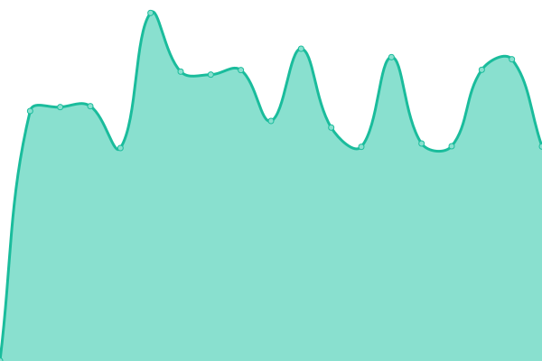 885ms
     
 | 

<a href="https://LeeYoungJin.github.io/fg_upptime/history/naver2">98.46%</a>
    

|  [Naver3](https://navercomp3.wisereport.co.kr/v2/servercheck.aspx) | 🟩 Up | [naver3.yml](https://github.com/LeeYoungJin/fg_upptime/commits/HEAD/history/naver3.yml) | 

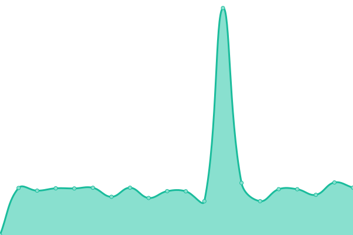 1089ms
     
 | 

<a href="https://LeeYoungJin.github.io/fg_upptime/history/naver3">98.50%</a>
    

|  [CompanyGlobal1](https://compglobal1.wisereport.co.kr/Home/ServerCheck) | 🟩 Up | [company-global1.yml](https://github.com/LeeYoungJin/fg_upptime/commits/HEAD/history/company-global1.yml) | 

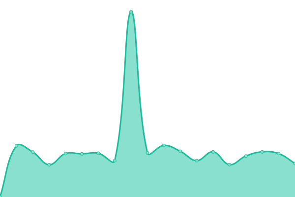 1192ms
     
 | 

<a href="https://LeeYoungJin.github.io/fg_upptime/history/company-global1">98.54%</a>
    

|  [CompanyGlobal2](https://compglobal2.wisereport.co.kr/Home/ServerCheck) | 🟩 Up | [company-global2.yml](https://github.com/LeeYoungJin/fg_upptime/commits/HEAD/history/company-global2.yml) | 

 1188ms
     
 | 

<a href="https://LeeYoungJin.github.io/fg_upptime/history/company-global2">98.72%</a>
    

|  [CompanyGlobal3](https://compglobal3.wisereport.co.kr/Home/ServerCheck) | 🟩 Up | [company-global3.yml](https://github.com/LeeYoungJin/fg_upptime/commits/HEAD/history/company-global3.yml) | 

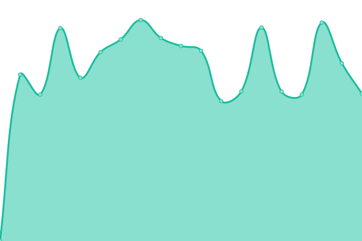 1201ms
     
 | 

<a href="https://LeeYoungJin.github.io/fg_upptime/history/company-global3">99.34%</a>
    

|  [MobileCompanyGlobal1](https://mglobal1.wisereport.co.kr/Home/ServerCheck) | 🟩 Up | [mobile-company-global1.yml](https://github.com/LeeYoungJin/fg_upptime/commits/HEAD/history/mobile-company-global1.yml) | 

 851ms
     
 | 

<a href="https://LeeYoungJin.github.io/fg_upptime/history/mobile-company-global1">99.35%</a>
    

|  [MobileCompanyGlobal2](https://mglobal2.wisereport.co.kr/Home/ServerCheck) | 🟩 Up | [mobile-company-global2.yml](https://github.com/LeeYoungJin/fg_upptime/commits/HEAD/history/mobile-company-global2.yml) | 

 880ms
     
 | 

<a href="https://LeeYoungJin.github.io/fg_upptime/history/mobile-company-global2">99.37%</a>
    

|  [MobileCompanyGlobal3](https://mglobal3.wisereport.co.kr/Home/ServerCheck) | 🟩 Up | [mobile-company-global3.yml](https://github.com/LeeYoungJin/fg_upptime/commits/HEAD/history/mobile-company-global3.yml) | 

 884ms
     
 | 

<a href="https://LeeYoungJin.github.io/fg_upptime/history/mobile-company-global3">99.38%</a>
    

|  [ETFGlobal1](https://globaletf1.wisereport.co.kr/Home/ServerCheck) | 🟩 Up | [etf-global1.yml](https://github.com/LeeYoungJin/fg_upptime/commits/HEAD/history/etf-global1.yml) | 

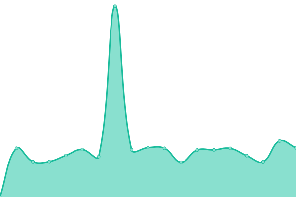 1043ms
     
 | 

<a href="https://LeeYoungJin.github.io/fg_upptime/history/etf-global1">99.40%</a>
    

|  [ETFGlobal2](https://globaletf2.wisereport.co.kr/Home/ServerCheck) | 🟩 Up | [etf-global2.yml](https://github.com/LeeYoungJin/fg_upptime/commits/HEAD/history/etf-global2.yml) | 

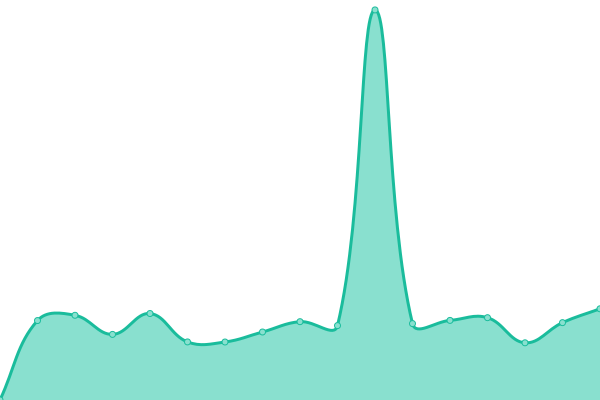 846ms
     
 | 

<a href="https://LeeYoungJin.github.io/fg_upptime/history/etf-global2">99.41%</a>
    

|  [ETFGlobal3](https://globaletf3.wisereport.co.kr/Home/ServerCheck) | 🟩 Up | [etf-global3.yml](https://github.com/LeeYoungJin/fg_upptime/commits/HEAD/history/etf-global3.yml) | 

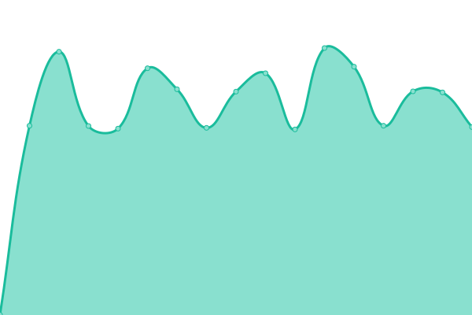 1027ms
     
 | 

<a href="https://LeeYoungJin.github.io/fg_upptime/history/etf-global3">99.42%</a>
    

|  [MobileETFGlobal1](https://mglobaletf1.wisereport.co.kr/Home/ServerCheck) | 🟩 Up | [mobile-etf-global1.yml](https://github.com/LeeYoungJin/fg_upptime/commits/HEAD/history/mobile-etf-global1.yml) | 

 845ms
     
 | 

<a href="https://LeeYoungJin.github.io/fg_upptime/history/mobile-etf-global1">92.40%</a>
    

|  [MobileETFGlobal2](https://mglobaletf2.wisereport.co.kr/Home/ServerCheck) | 🟩 Up | [mobile-etf-global2.yml](https://github.com/LeeYoungJin/fg_upptime/commits/HEAD/history/mobile-etf-global2.yml) | 

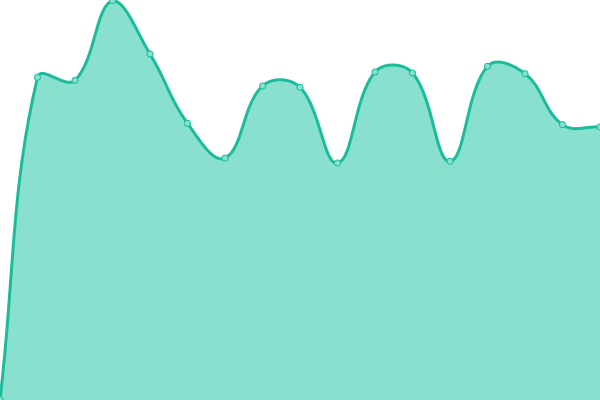 1061ms
     
 | 

<a href="https://LeeYoungJin.github.io/fg_upptime/history/mobile-etf-global2">92.41%</a>
    

|  [MobileETFGlobal3](https://mglobaletf3.wisereport.co.kr/Home/ServerCheck) | 🟩 Up | [mobile-etf-global3.yml](https://github.com/LeeYoungJin/fg_upptime/commits/HEAD/history/mobile-etf-global3.yml) | 

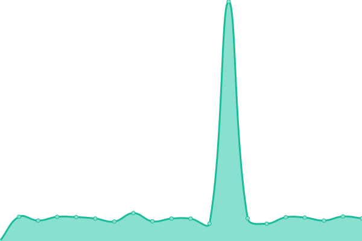 856ms
     
 | 

<a href="https://LeeYoungJin.github.io/fg_upptime/history/mobile-etf-global3">92.42%</a>
    

<!--end: status pages-->

[**Visit our status website →**](https://LeeYoungJin.github.io/fg_upptime)

## 📄 License

- Powered by: [Upptime](https://github.com/upptime/upptime)
- Code: [MIT](./LICENSE) © [LeeYoungJin](https://LeeYoungJin.github.io/fg_upptime)
- Data in the `./history` directory: [Open Database License](https://opendatacommons.org/licenses/odbl/1-0/)
